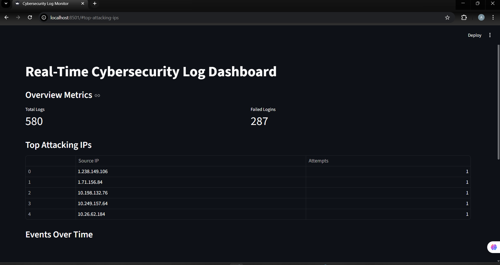
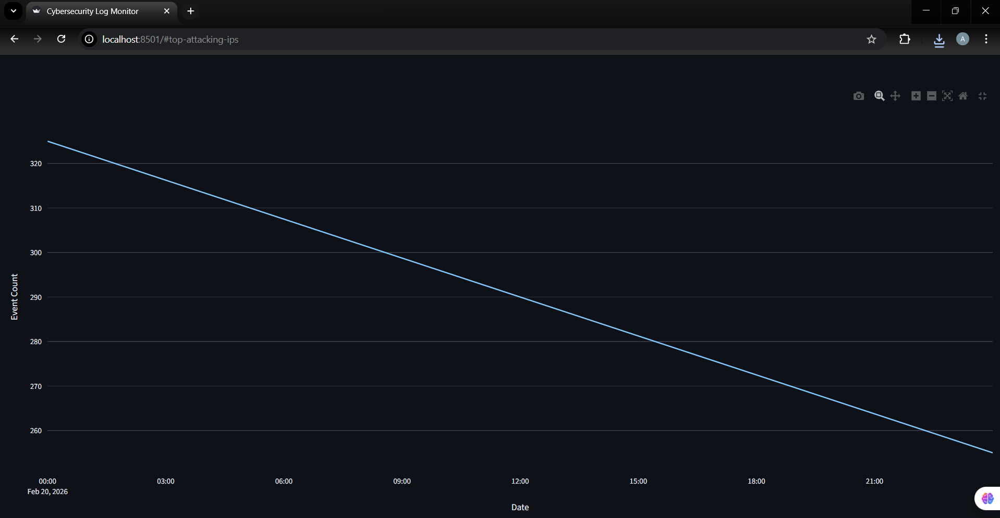
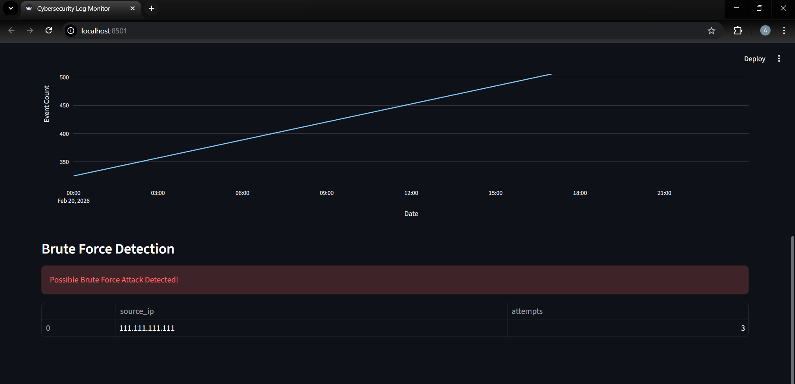

# ThreatPulse - Live Security Log Monitoring and Behavioral Analysis System

**Overview:**
*A real-time cybersecurity analytics dashboard built using Python, MySQL, and Streamlit. The system simulates security logs, stores them in a relational database, and provides live monitoring with brute-force attack detection. This system is designed as a continuously running backend monitoring tool. Visualization is secondary to detection integrity.*

**Tech Stack:**
* Python 3.12
* MySQL 8.0
* Streamlit
* mysql-connector-python
* python-dotenv
* pandas

**Features:**
1. Real-time log simulation
2. MySQL database integration
3. Interactive dashboard
4. Top attacking iP detection
5. Event trend visualisation
6. Brute-force attack detection logic
7. Secure environment variable configuration

***Brute Force Detection Logic***

Detects IP addresses that:

      *Exceed a defined login failure threshold*

      *Within a specified time window*

*This simulates real-world intrusion detection techniques used in SIEM systems.*

**Dashboard Components:**
1. Total logs Counter
2. Failed Login Counter
3. Top Attacking IPs Table
4. Events Over Time Graph
5. Security Alert banner(for brute-force detection)

**Security Practices Implemented:**
* Credentials stored in .env
* No hardcoded secrets
* Modular backend architecture
* Clean separation of logic and presentation
* .gitignore to exclude sensitive files

### Project Structure
```
backend/
    db_config.py
    log_generator.py
    queries.py

dashboard/
    app.py

database/
    schema.sql

screenshot/
     dashboard_overview.png
     brute_force_detection.png
     graph.png

.env
requirements.txt
README.md
```

**How to run?**

*The steps are as follows:-*

        1. Clone repository

        2. Create virtual environment

        3. Install dependencies:
            pip install -r requirements.txt

        4. Add .env file:
            DB_HOST=localhost 
            DB_USER=root 
            DB_PASSWORD=your root password 
            DB_NAME=cyber_logs

        5. Start log generator:
            python backend/log_generator.py

        6. Start dashboard:
            streamlit run dashboard/app.py

***Real-World Relevance***

*This project simulates core functionalities of a Security Information and Event Management(SIEM) system:*
* Log ingestion
* Event aggregation
* Attack pattern detection
* Real-time visualization

## System Architecture
```       
        │   Log Generator      │
        │   (backend layer)    │
        └───────────┬──────────┘
                    │
                    ▼
        ┌──────────────────────┐
        │     MySQL Database   │
        │      (cyber_logs)    │
        └───────────┬──────────┘
                    │
                    ▼
        ┌──────────────────────┐
        │   Detection Engine   │
        │   (queries module)   │
        └───────────┬──────────┘
                    │
                    ▼
        ┌──────────────────────┐
        │  Streamlit Dashboard │
        │   (Visualization)    │
        
```

## Screenshots

***Dashboard Overview***



***Events Over Time Graph***



***After Brute Force Detection***



## Creator:
Anushka Sarkar
BTech CSE | Cybersecurity & Data Systems Enthusiast
